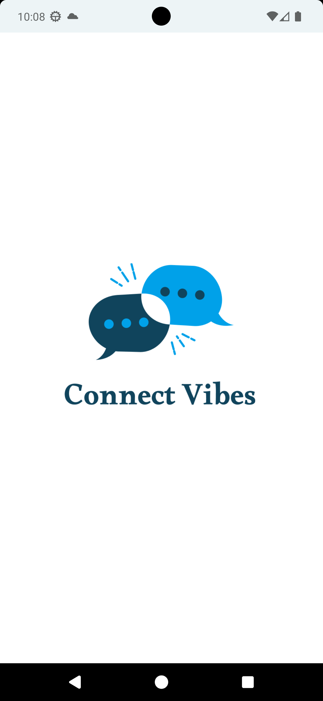
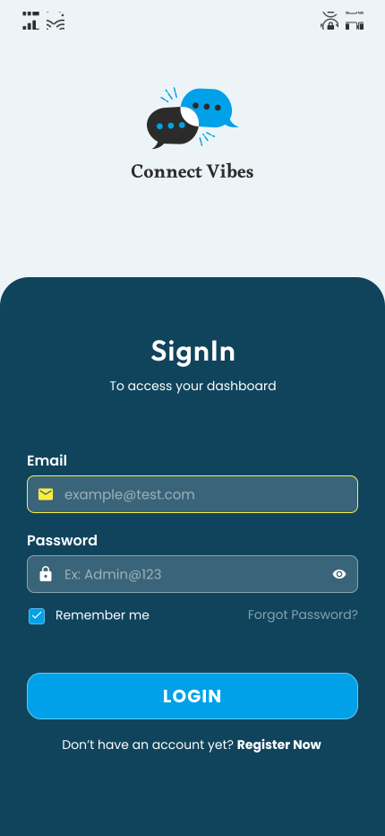
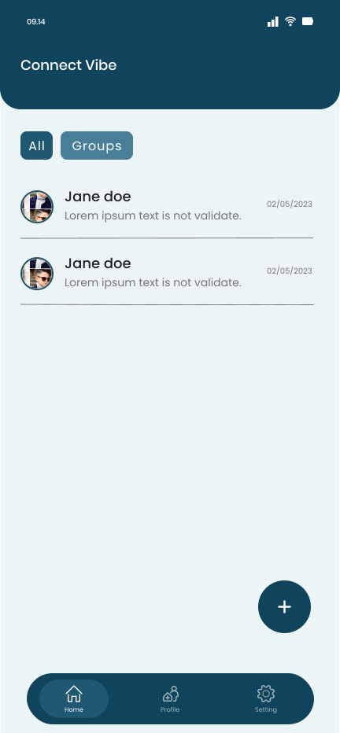
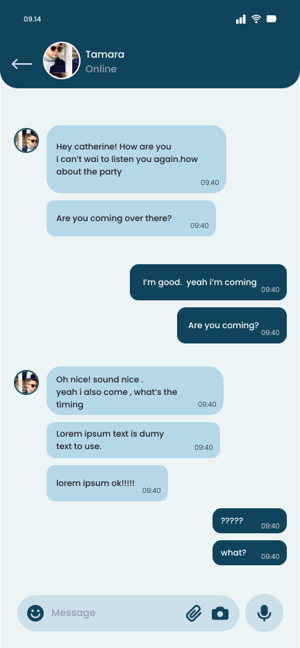
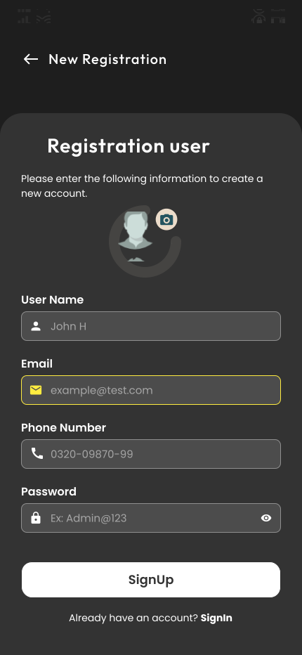
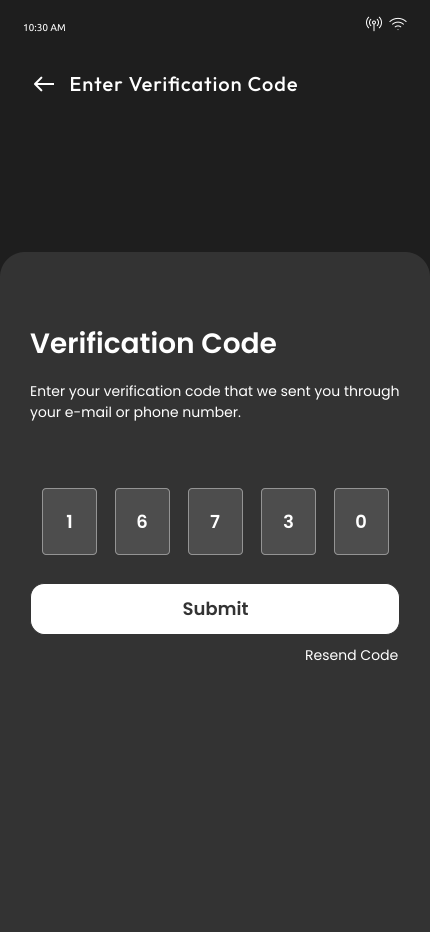
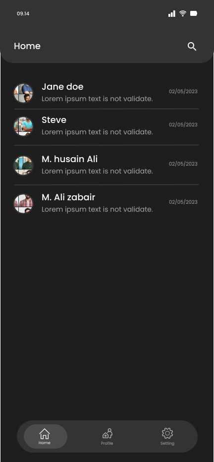
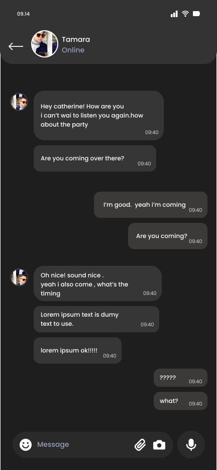

# ConnectVibe
React-Native ChatApp

## Screenshots

### 1. Login Screen  

  
  

  

### 2. Home Screen and Chat Screen  

  
  

  

### Dark Mode  

  
  

  

  
  

  

## Technologies Used

This project was built using the following technologies:

- [React Native](https://reactnative.dev/): A framework for building native apps using React.
- [Firebase](https://firebase.google.com/): Used for real-time database, messaging, and push notifications.
- [Redux-Saga](https://redux-saga.js.org/): A library to manage side effects in Redux applications.
- [redux-persist](https://github.com/rt2zz/redux-persist): To persist the Redux state across app restarts.
- [AsyncStorage](https://github.com/react-native-async-storage/async-storage): Storage solution for persisting data locally in React Native apps.

